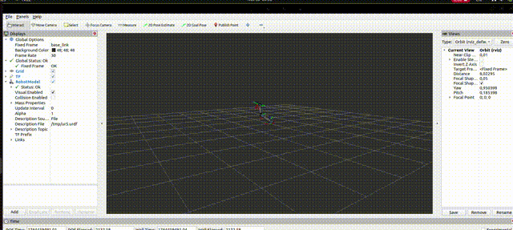

# UR5 HRI Manipulation – ROS2 Simulation Demo

This project demonstrates a ROS2-based simulation of a UR5 manipulator for Human–Robot Interaction (HRI).  
It includes a custom ROS2 node that publishes joint trajectories and moves the UR5 robot inside RViz.

---

## 📌 Features Implemented

### ✔ 1. UR5 Robot Visualization
- UR5 URDF loaded into RViz  
- Custom RViz configuration (`ur5_hri_simulation_fixed.rviz`)  
- Robot model fully visible with correct TFs  

### ✔ 2. ROS2 Joint-Motion Node
A custom ROS2 Python node:

`src/ur5_joint_motion_node.py`

Implements:
- Joint-state publishing  
- Periodic sinusoidal motion on selected joints  
- Smooth, continuous robot movement  
- No GUI sliders required  

Run using:

```bash
ros2 run hri_manipulation ur5_joint_motion_node
````

---

## 🎥 Demo Video

`videos/ur5_joint_motion_demo.mp4`

Shows:

* UR5 robot rendering in RViz
* Joint motion generated by the Python ROS2 node


## 🎥 Demo


---

## 🖼 Screenshots

Inside `images/`:

* `ur5_demo_screenshot.png` – UR5 visible in RViz
* Additional captures if needed

---

## 📦 Project Structure

```
ros2_ur5_sim/
│
├── src/
│   └── ur5_joint_motion_node.py
│
├── rviz/
│   └── ur5_hri_simulation_fixed.rviz
│
├── images/
│   └── ur5_demo_screenshot.png
│
└── videos/
    └── ur5_joint_motion_demo.mp4
```

---

## 🚀 How to Run

### 1. Load RViz

```bash
rviz2 -d ~/ros2_ws/ur5_hri_simulation_fixed.rviz
```

### 2. Start Motion Node

```bash
source ~/ros2_ws/install/setup.bash
ros2 run hri_manipulation ur5_joint_motion_node
```

---

## 📘 Goal of the Project

This project simulates core HRI/Manipulation concepts:

* Robot motion control
* Joint-space trajectory generation
* Visualization of manipulator kinematics
* ROS2 node–based arm actuation

## 🦾 HRI Manipulation – Planar 3-DoF Arm 

This part of the repository implements a **HRI manipulation ** using a planar 3-DoF arm model in Python + ROS2.  
It covers the full pipeline from kinematics to interaction:

### Implemented Components

- **Planar Arm Kinematics (`planar_arm.py`)**
  - 3-DoF planar manipulator
  - Forward kinematics: \[(q1, q2, q3) → (x, y, α)\]
  - Inverse kinematics: \[(x, y, α) → (q1, q2, q3)\]

- **IK Node (`ik_node.py`)**
  - ROS2 node that computes IK for a fixed end-effector target
  - Publishes joint angles on topic: `/joint_angles` (`Float64MultiArray`)

- **Jacobian + Torque Mapping Node (`jacobian_torque_node.py`)**
  - Subscribes to `/joint_angles`
  - Computes the analytical Jacobian of the 3-DoF arm
  - Uses **τ = Jᵀ·F** to map a simulated force vector **F** to joint torques
  - Publishes torques on `/joint_torque` (`Float64MultiArray`)

- **Admittance Control Node (`admittance_node.py`)**
  - Subscribes to `/joint_torque`
  - Converts torque magnitude → external force input
  - Simulates 1-DoF **admittance control** using a mass–spring–damper model:

    \[
    M \ddot{x} + D \dot{x} + K x = F
    \]

  - Integrates position over time and publishes on `/admittance_position`

### How to Run (Task 2 Pipeline)

In three terminals:

```bash
# Terminal 1 – Inverse Kinematics node
ros2 run hri_manipulation ik_node

# Terminal 2 – Jacobian torque node
ros2 run hri_manipulation jacobian_torque_node

# Terminal 3 – Admittance control node
ros2 run hri_manipulation admittance_node

---

## Task 3 – Jacobian-Transpose Torque Mapping (Simulation)

This folder contains a Python implementation of:

- Forward Kinematics (FK)
- Inverse Kinematics (IK)
- Jacobian computation for a 3-DoF planar manipulator
- Torque mapping using τ = JᵀF

These scripts simulate the core mathematical concepts used in manipulator
interaction tasks without requiring any hardware or robot model. 
See `hri_tasks/planar_arm.py` for the complete implementation.


# 🟦 **Task 4 – Teleoperation & Human–Robot Interaction (Simulation Only)**

This task implements the key concepts of teleoperation and force-based interaction **entirely in ROS2 simulation** (no hardware or joystick required).
Three nodes were developed to replicate the core functionality of the lab task:

---

## 🔹 **1. `fsr_sensor.py` — Simulated Force Sensor Publisher**

Publishes a smooth oscillating force signal on the topic **`/pub_force`**.

* Output range: **0 → 20 N**
* Frequency: 10 Hz
* Purpose: simulate tactile/force input from an FSR sensor

---

## 🔹 **2. `mapping_node.py` — Force Normalization (0–1)**

Subscribes to raw force → normalizes using:

[
f_{mapped} = \frac{f}{\text{max_sensor_force}}
]

* ROS parameter: **`max_sensor_force`**
* Publishes on **`/force_mapped`**
* Clamps values to the valid range [0, 1]

---

## 🔹 **3. `teleoperation.py` — Simulated Joystick + Haptic Feedback**

Imitates a teleoperation system:

### ✔ Simulated joystick

Generates a time-based twist command:

* `cmd_vel.linear.x`
* `cmd_vel.angular.z`
* Simulated gripper width

### ✔ Haptic vibration

Uses **`force_mapped`** to print vibration intensity (0–1).

### ✔ Topics:

* Publishes: **`/cmd_vel`**, **`/gripper_width`**
* Subscribes: **`/force_mapped`**

---

## 🔹 **4. Architecture Overview**

```
fsr_sensor  →  pub_force
      ↓
mapping_node  →  force_mapped
      ↓
teleoperation  →  cmd_vel, gripper_width, vibration output
```

This reproduces the conceptual teleoperation pipeline:

* sensing
* mapping
* interaction feedback

without any physical device.

---

## 🔹 **Run the pipeline**

Terminal 1:

```bash
ros2 run hri_manipulation fsr_sensor
```

Terminal 2:

```bash
ros2 run hri_manipulation force_mapping_node
```

Terminal 3:

```bash
ros2 run hri_manipulation teleoperation_node
```

---

## 🔹 **Outcome**

This simulation successfully demonstrates:

* sensor signal processing
* parameter handling
* normalized force mapping
* teleoperation logic
* haptic interaction model

All work is **software-only**, matching real HRI concepts while remaining fully portable.

---

